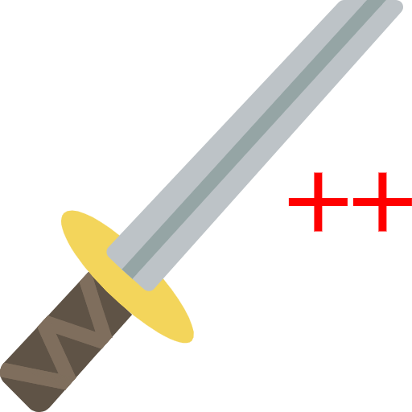
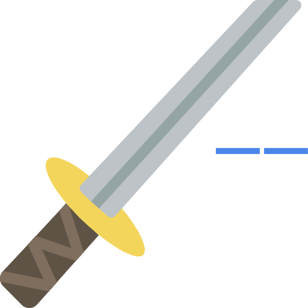
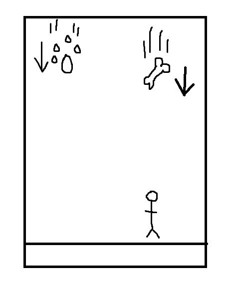
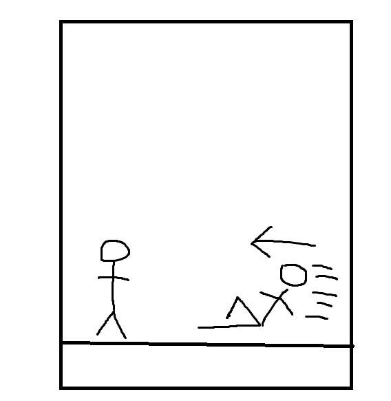
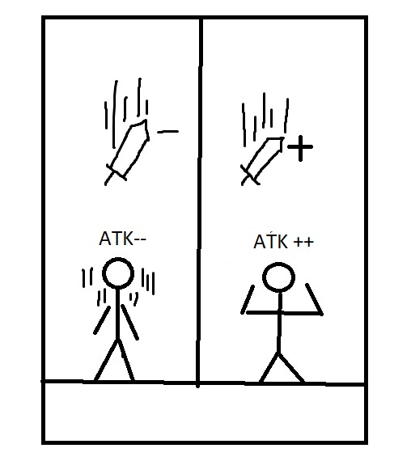

# Hexenkatze

## Kelompok 5 : A11.4701
> 1.	Al Birr Karim Susanto(A11.2017.10642)[Programmer]
> 2.	Yumnanda Abid Saputra(A11.2017.10651)[Programmer] 
> 3.	Imam Septian AW(A11.2017.10240)[Designer]
> 4.	Aldo Doohan(A11.2017.10141)[Artist]
> 5.	Lyongky Suryono T(A11. 2017.10255)[Designer]
> 6.	Ahmad Faisal(A11.2017.10257)[Artist]

## Chapter 1 : Game Overview
### a.	Perkenalan
Permainan 2D yang bertemakan tentang penyihir kucing yang berusaha mengumpulkan kembali kekuatan nya yang hilang sehingga dapat mengalahkan anjing yang telah membuat Penyihir kucing kehilangan kekuatan nya. Tentu saja anjing akan menghalangi penyihir kucing dengan menyerang kucing dalam pengumpulan kekuatannya. 

### b.	Objektif permainan
Objektif permainan ini adalah kucing mampu mempertahankan bar HP agar tidak habis hingga bar attack akan penuh dan membuat i anjing kalah dengan kekuatan penuh dari kucing. 

### c.	Genre
Action-survival

### d.	Fitur
*	Permainan 2D
*	Third person view
*	Solo player
*	Fixed camera
*	Dinamis Musik 

### e.	Platform
Game 2D ini akan berjalan di android dan dapat dimainkan juga melalui PC atau laptop dengan emulator berbasis android

### f.	Kategori pemain
Pemain yang direkomendasikan dalam permainan ini adalah pemain dari umur 12 tahun keatas. Dikarenakan permainan ini butuh konsentrasi dan kelincahan untuk dapat menyelesaikan permainan ini. 

### g.	Bahasa
Bahasa yang digunakan dalam game ini adalah bahasa indonesia

### h.	Music
Music yang digunakan di permainan ini beragam sehingga membuat menarik dengan efek musik pada setiap tantangan maupun pada awal permainan. Contohnya adalah ketika kucing bersentuhan dengan item, bertemu dengan anjing, terkena serangan, hingga menyelesaikan permainan ini. 

## Chapter 2	: Story
### a.	Outline 
Liana adalah seekor kucing penyihir dari klan Kocheng, suatu hari kehilangan kekuatan dan kemampuan penglihatannya karena bertarung dengan seekor Anjing. Liana ingat bahwa ada satu cara untuk mengembalikan kembali kemampuan pengelihatannya yaitu dengan memakan 7 makanan kucing yang jatuh dari hutan kucing keramat. Namun Anjing yang mengalahkan Liana mengetahui bahwa Liana berupaya untuk memulihkan penglihatannya sehingga dia tidak tinggal diam. Anjing berupaya mengganggu Liana supaya penglihatannya tidak kembali dan Liana harus dapat bertahan dari gangguan si Anjing supaya kekuatan dia kembali.

### b.	Story Synopsis
Menceritakan kisah Liana seorang kucing penyihir dari klan Kocheng, suatu hari kehilangan kekuatan dan kemampuan penglihatannya karena bertarung dengan seekor Anjing. Tanpa kekuatan dan penglihatan Liana sangatlah lemah dan tidak berdaya. Namun suatu saat Liana ingat bahwa ada satu cara untuk mengembalikan kembali kemampuan pengelihatannya yaitu dengan mengumpulkan kekuatan sehingga mampu mengeluarkan serangan utama. Namun Anjing yang mengalahkan Liana mengetahui bahwa Liana berupaya untuk memulihkan penglihatannya sehingga dia tidak tinggal diam. Anjing berupaya mengganggu Liana supaya penglihatannya tidak kembali dengan menjatuhkan makanan yang beracun supaya Liana salah makan kemudian mati.
Karena Liana tahu si Anjing pasti akan mengganggunya maka dia meminta bantuan seorang petualang untuk memandu dia agar dia memakan makanan yang tepat dari hutan kucing. Liana dan sang petualang harus dapat bekerja sama agar kekuatan Liana kembali. Dapatkah mereka melewati rintangan dan jebakan yang telah disiapkan oleh Anjing? Kuncinya ada di sang petualang apakah dia dapat memandu Liana yang tidak bisa melihat memakan makanan yang tepat?

## Chapter 3 : Game Mechanic
### a.	Camera
Camera dalam game ini statis

### b.	Single player
Game ini hanya bisa single player

### c.	General Movement
Player bisa berpindah tempat dengan menekan tombol W – A – S – D

### d.	Jumping
Player bisa lompat dengan menekan tombol spasi

### e.	Health Bar
Health akan berkurang jika anjing menyerang player, jika health bar kosong maka player mati.

### f.	Bar Attack
Jika attack bar penuh maka player menang

### g.	Attack Power

Attack power (kekuatan serangan ) jika player mengenai item sword plus 

Attack power akan berkurang jika player mengenai item sword min

### h.	Dog Attack
Anjing bisa menyerang player dalam interval statis

### i.	Objects

Gambar tulang berfungsi sebagai tantangan untuk pemain . Jika karakter utama / player terkena tulang , maka akan mengeluarkan efek negatif pada player

Gambar makanan kucing berfungsi untuk menambah nyawa kucing / player

### j.	Screen Flow

### h.	Screen
* Splash Screen

* Loading Screen

* Main Menu Screen

* Option & Info Screen

* How to play screen

* Game Over Screen

* Game Play

* Win Screen

* Pause Screen

* Credit

## Chapter 4 : Karakter dan Suara
### 4.1 Characters
#### 4.1.1 Main Character

Ini adalah karakter utama yang akan dimainkan oleh player dalam permainan ini

#### 4.1.2 Main Enemy

Ini adalah karakter musuh utama (anjing) yang akan menjadi lawan dari karakter utama dalam permainan ini

### 4.2 AUDIO
* Music :
Backsound saat tidak berhadapan dengan Bos
Backsound saat berhadapan dengan Bos

* SFX :
Game Over

## Chapter 5 : Stage
### a.	Gambaran umum
Stage dalam game ini terbagi menjadi dua yaitu normal dan hard. Untuk normal , air akan memiliki efek negatif seperti mengurangi bar HP, tulang memiliki efek negatif seperti reverse kontrol dan mengurangi bar HP, makanan dan ikan memiliki efek menambah bar HP player, dan pedang memiliki efek menambah bar attack sebagai objektif di game ini. Untuk hard, air akan memiliki efek negatif seperti mengurangi bar HP dan slow, tulang memiliki efek negatif seperti mengurangi bar HP, reverse control, dan stun.

### b.	Pola stage

Gambaran umum game yang akan dibuat. Item akan jatuh dari atas dan player akan menggerakan karakter dibawah. 

Gambar ketika musuh akan menyerang player dari kanan atau kiri dengan interval statis

Gambar ketika player menerima item seperti makanan , ikan, air, tulang, pedang
